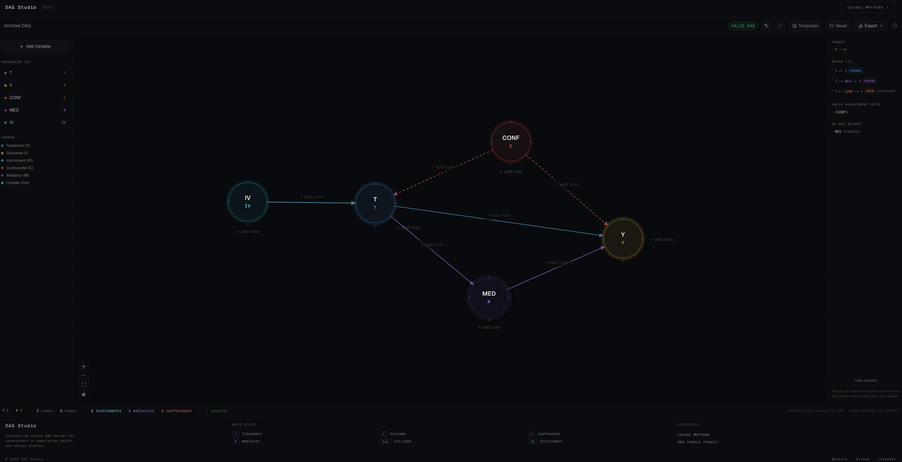
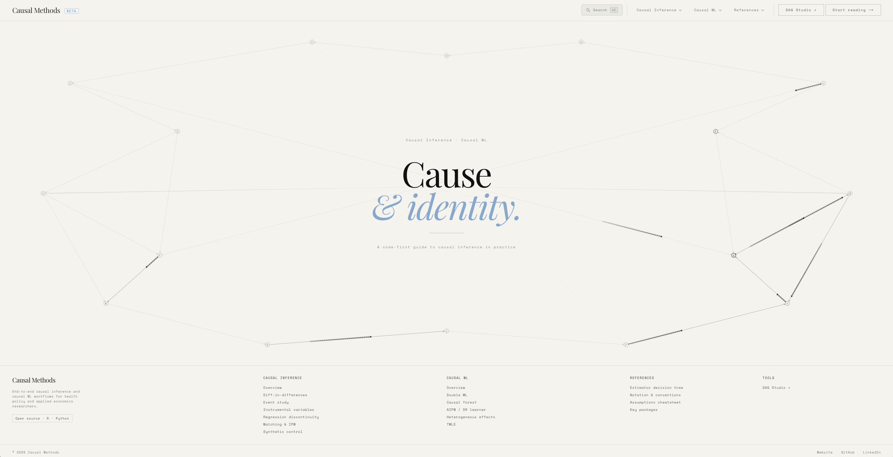
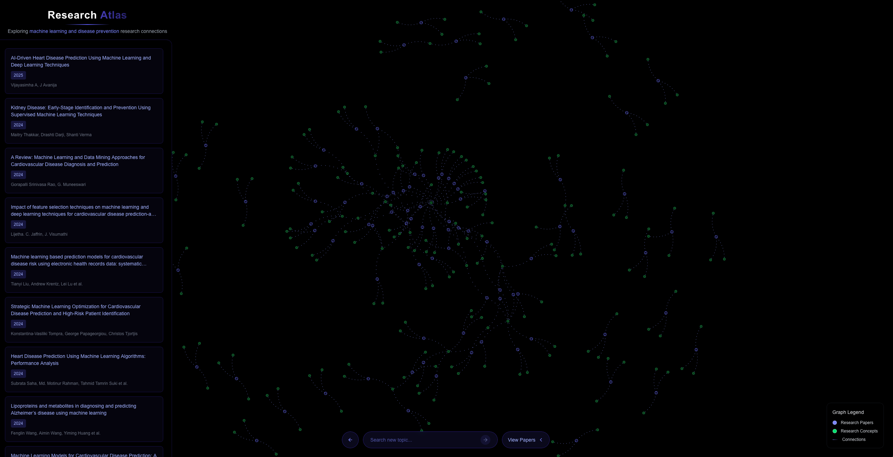
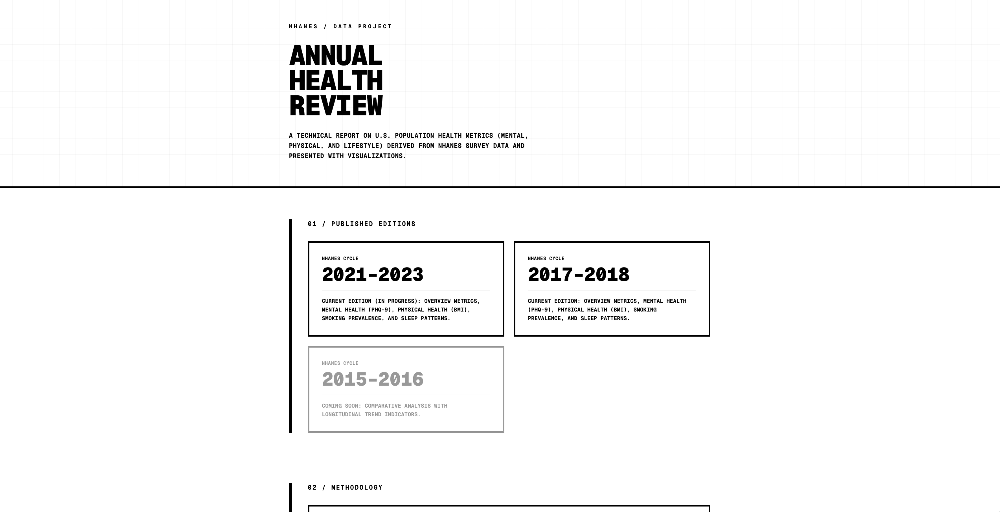
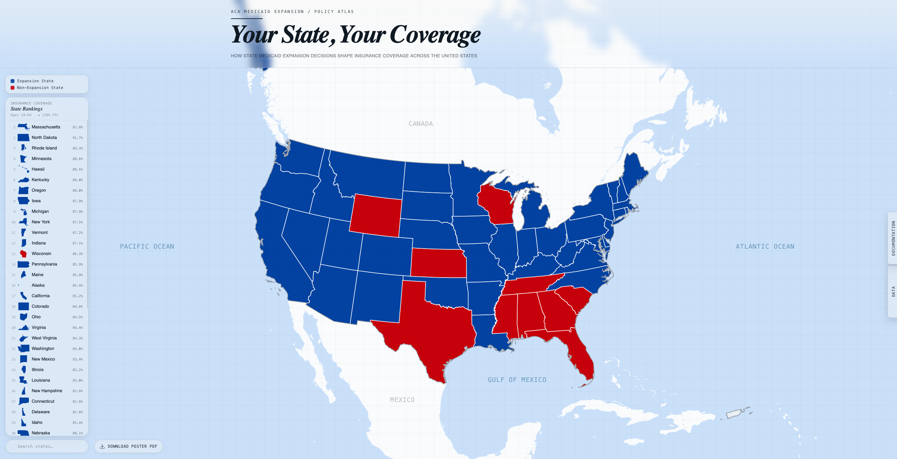

<p align="center">
  
</p>

<p align="center">
  
</p>

<br/>

```yaml
name:       Chayce Reed
location:   Boston, MA
role:       Graduate Research Assistant · Computational Causal Inference
education:  UMass Amherst · Dartmouth College (MS Health Data Science)
industry:   BMS · Moderna · Oncorus
consulting: Datageek Designs LLC
website:    chaycereed.com
```

<p align="center">
  <a href="https://chaycereed.com"></a>&nbsp;
  <a href="https://www.linkedin.com/in/chaycereed"></a>
</p>

---

### Research

My work centers on **computational causal inference for population health and health systems**. I study how policies, systems, and social environments shape health behaviors and outcomes, using causal ML to uncover mechanisms, evaluate interventions, and inform decision-making.

**Methods**

<p>
  
  
  
  
  
  
  
</p>

**Stack**

<p>
  
  
  
  
</p>

---

### Projects

<div align="center">

| | | |
|:---:|:---:|:---:|
| [](https://dag-studio.com) | [](https://causal-methods.com) | [](https://researchatlas.ai) |
| [](https://annualhealthreview.com) | [](https://medicaid-map.com) | |

</div>

<br/>

<details>
<summary><b>dag-studio.com</b> &mdash; Interactive DAG Construction and Analysis &nbsp;<code>web</code></summary>
<br>

| | |
|---|---|
| **Features** | Identification analysis · Adjustment sets |
| **Link** | [dag-studio.com](https://dag-studio.com) |

</details>

<details>
<summary><b>causal-methods.com</b> &mdash; Code-First Reference for Causal Inference and Causal ML &nbsp;<code>web</code></summary>
<br>

| | |
|---|---|
| **Coverage** | DiD · IV · TMLE · DML · AIPW · Synthetic Control · Causal Forests |
| **Languages** | `R` `Python` |
| **Link** | [causal-methods.com](https://causal-methods.com) |

</details>

<details>
<summary><b>researchatlas.ai</b> &mdash; NLP and Knowledge-Graph Literature Explorer &nbsp;<code>web</code></summary>
<br>

| | |
|---|---|
| **Tech** | Semantic Scholar API · NLP embeddings · Force-directed graphs |
| **Link** | [researchatlas.ai](https://researchatlas.ai) |
| **Stack** | `Python` `FastAPI` `Next.js` `react-force-graph` |

</details>

<details>
<summary><b>annualhealthreview.com</b> &mdash; U.S. Population Health Metrics · NHANES &nbsp;<code>web</code></summary>
<br>

| | |
|---|---|
| **Data** | NHANES — mental, physical, and lifestyle health metrics |
| **Link** | [annualhealthreview.com](https://annualhealthreview.com) |
| **Stack** | `Python` `Next.js` `plotly.js` `dplyr` `haven` |

</details>

<details>
<summary><b>medicaid-map.com</b> &mdash; Interactive Visualization of Medicaid Expansion Effects &nbsp;<code>web</code></summary>
<br>

| | |
|---|---|
| **Design** | Sun-Abraham DiD · ACS PUMS 2010–2023 · State-level treatment variation |
| **Outputs** | Research poster · Interactive Next.js / D3.js website |
| **Link** | [medicaid-map.com](https://medicaid-map.com) |
| **Stack** | `R` `fixest` `TypeScript` `D3.js` |

</details>

---

### R Packages

<details>
<summary><b>wmap</b> &mdash; Transportability and Generalizability Weights &nbsp;<code>R</code></summary>
<br>

| | |
|---|---|
| **API** | `balancing_weights()` · `causal_estimate()` |
| **Status** | In progress |

</details>

<details>
<summary><b>translate</b> &mdash; Causal Transport Across Populations &nbsp;<code>R</code></summary>
<br>

| | |
|---|---|
| **API** | `translate()` · `translate_weights()` · `translate_estimate()` |
| **Status** | In progress |

</details>

<details>
<summary><b>nhanesqc</b> &mdash; NHANES Preprocessing Pipeline &nbsp;<code>R</code></summary>
<br>

| | |
|---|---|
| **Features** | Recoding · Missingness · Special values · Cycle consistency |
| **Status** | Complete |

</details>

<details>
<summary><b>lotr</b> &mdash; Lord of the Rings Color Palettes for ggplot2 &nbsp;<code>R</code></summary>
<br>

| | |
|---|---|
| **Features** | 10 palettes · `scale_color_lotr()` · `scale_fill_lotr()` |
| **Status** | Complete |

</details>

---

### CLI Tools

<details>
<summary><b>researchkit</b> &mdash; Reproducible Research Project Scaffolding &nbsp;<code>cli</code></summary>
<br>

| | |
|---|---|
| **Purpose** | Standardized templates and automation for reproducible analysis projects |
| **Stack** | `Python` |

</details>

<details>
<summary><b>metascholar</b> &mdash; Automated Literature Retrieval and Reporting &nbsp;<code>cli</code></summary>
<br>

| | |
|---|---|
| **Purpose** | Automated retrieval, metadata extraction, structured reports via Semantic Scholar |
| **Stack** | `Python` |

</details>

---

### Activity

<div align="center">
  
  <br/><br/>
  
</div>

---

<p align="center">
  
</p>

<p align="center">
  <sub><code>Boston, MA · chaycereed.com</code></sub>
</p>
